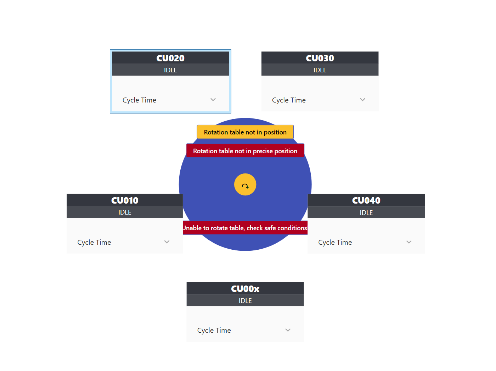

# RadialPanel

`RadialPanel` is a custom WPF `Panel` that automatically arranges its child elements around a circle centered within the panel.

The panel supports:

- Configurable circle radius (`Radius`)
- Clockwise or counter-clockwise arrangement (`Clockwise`)
- Initial rotation offset (`RotationOffset`)
- Centered element support (`IsCenter`)

---

# Features

## Radius

Defines the distance of elements from the center of the panel.

```xml
Radius="150"
```

Default value:

```text
250
```

---

## Clockwise

Determines the direction in which elements are arranged.

```xml
Clockwise="True"
```

| Value | Description |
|---------|-------------|
| True | Clockwise |
| False | Counter-clockwise |

Default value:

```text
True
```

---

## RotationOffset

Defines the starting angle (in degrees) for the first element.

```xml
RotationOffset="90"
```

Examples:

| Value | First element position |
|---------|-----------------------|
| 0 | Right |
| -90 | Top |
| 90 | Bottom |
| 180 | Left |

Default value:

```text
-90
```

> Note:
>
> With `RotationOffset="90"`, the first element is placed at the bottom of the circle.

---

# Attached Property

## IsCenter

Marks an element that should be positioned in the center of the panel.

Such an element:

- Is excluded from circular arrangement
- Is automatically centered within the panel

Example:

```xml
controls:RadialPanel.IsCenter="True"
```

---

# How It Works

All child elements without `IsCenter="True"` are evenly distributed around the circle.

For `N` elements, the angular spacing is calculated as:

```text
360° / N
```

Example for 5 elements:

```text
0°
72°
144°
216°
288°
```

---

# Position Calculation

For each element, the following coordinates are calculated:

```csharp
x = centerX + radius * cos(angle)
y = centerY + radius * sin(angle)
```

The element size is then taken into account so that the element is centered on the calculated position.

---

# Effective Radius

The `Radius` property represents the distance from the panel center to the edge of an element.

For this reason, the actual radius used during layout is:

```csharp
effectiveRadius =
    Radius +
    Math.Max(width, height) / 2;
```

This ensures that elements of different sizes are visually aligned on the same circle.

---

# Usage

## Namespace

```xml
xmlns:controls="clr-namespace:_sandboxHmi.Wpf.Controls;assembly=_sandboxHmi.Wpf"
```

## XAML Example

```xml
<controls:RadialPanel
    RotationOffset="90"
    Clockwise="True"
    Radius="150">

    <vortex:TcoCarouselSpotView
        x:Name="CenterElement"
        DataContext="{Binding _sandboxPlc.MAIN._technology._components.Carousel}"
        controls:RadialPanel.IsCenter="True"/>

    <!--<mainplc:CUBaseSpotView DataContext="{Binding _sandboxPlc.MAIN._technology._cu00x}"/>-->

    <mainplc:CUBaseSpotView
        DataContext="{Binding _sandboxPlc.MAIN._technology._cu00x}"/>

    <mainplc:CUBaseSpotView
        DataContext="{Binding _sandboxPlc.MAIN._technology._cu010}"/>

    <mainplc:CUBaseSpotView
        DataContext="{Binding _sandboxPlc.MAIN._technology._cu020}"/>

    <mainplc:CUBaseSpotView
        DataContext="{Binding _sandboxPlc.MAIN._technology._cu030}"/>

    <mainplc:CUBaseSpotView
        DataContext="{Binding _sandboxPlc.MAIN._technology._cu040}"/>

</controls:RadialPanel>
```

---

# Result

The following image shows a typical usage scenario. The carousel (`TcoCarouselSpotView`) is placed in the center, while the processing units (`CUBaseSpotView`) are evenly distributed around it.



---

# Notes

- The layout is automatically recalculated when:
  - `Radius` changes
  - `RotationOffset` changes
  - `Clockwise` changes

- Elements can have different sizes.

- Multiple elements may be marked with `IsCenter="True"`. All of them will be arranged at the center position.

- If no center element is defined, all child elements will be arranged around the circle.

- The panel automatically calculates its desired size based on:
  - The configured radius
  - The largest revolving child element

---

# Class Definition

```csharp
public class RadialPanel : Panel
```

Inherited from:

```csharp
System.Windows.Controls.Panel
```

Designed for use in WPF applications (.NET Framework and .NET).
